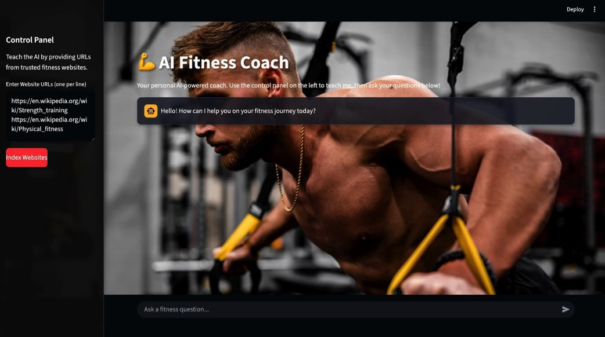
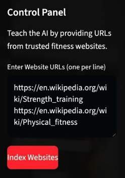
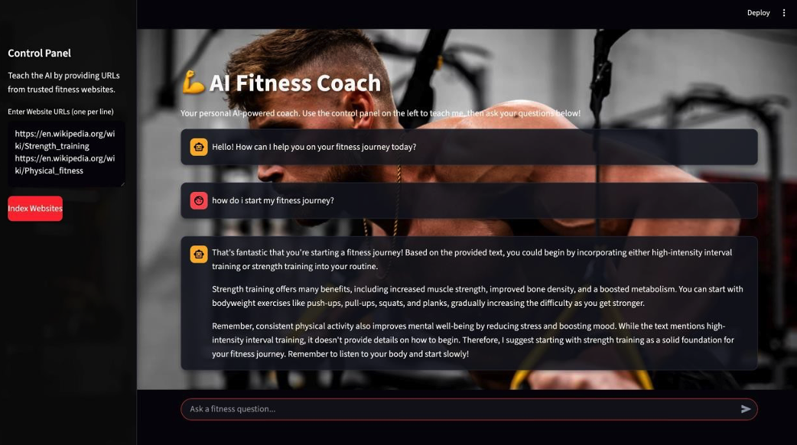

# 🤖 Domain-Specific Chatbot with RAG

A sophisticated domain-specific chatbot built using **LangChain**, **RAG architecture**, and **Streamlit**.  
The chatbot is multilingual, dynamically builds its knowledge base from websites, and provides context-aware, accurate responses.

---

## 1️⃣ Lab Objectives

The primary goals of this project were to:

1. **Understand LangChain Architecture** – Learn the workflow of building LLM-based applications.  
2. **Implement a Knowledge Base** – Create a domain-specific knowledge source for the chatbot.  
3. **Enable Multilingual Support** – Handle queries and responses in multiple languages.  
4. **Integrate RAG** – Use Retrieval-Augmented Generation for accurate, context-aware answers.  
5. **Deploy the Chatbot** – Build and deploy an interactive web interface.

---

## 2️⃣ Core Concept: Retrieval-Augmented Generation (RAG)

RAG enhances the capabilities of a Large Language Model (LLM) by grounding it in **external documents**, ensuring responses are domain-relevant and not hallucinated.

**Workflow:**

1. **Data Ingestion & Indexing**
   - **Load**: Import data (from `.txt` file or dynamic websites).  
   - **Split**: Break content into smaller chunks.  
   - **Embed**: Convert chunks into embeddings (semantic vectors).  
   - **Store**: Save embeddings in **FAISS vector DB** for efficient retrieval.  

2. **Query & Response**
   - **Retrieve**: Convert user query into vector → search vector store for relevant chunks.  
   - **Augment**: Combine user query + retrieved context into a detailed prompt.  
   - **Generate**: Send prompt to **Gemini-1.5-Flash LLM** to produce a final, accurate answer.  

This architecture prevents hallucination and makes the chatbot a **domain expert**.

---

## 3️⃣ Implementation Details

### 3.1 Knowledge Base Evolution
- **Phase 1 (Static File):** Used `knowledge_base.txt` with FAQs.  
- **Phase 2 (Dynamic Scraping):** Upgraded to scrape websites dynamically using:
  - `WikipediaLoader`  
  - `WebBaseLoader`  
  This allows the chatbot to adapt to any domain instantly.

### 3.2 Multilingual Support
- Implemented via LLM prompt:  
  > *"Please provide the answer in the same language as the user's question."*  
- The Gemini model automatically detects input language and replies in the same language.

---

## 4️⃣ Deployment & User Interface

The chatbot is deployed using **Streamlit**, providing an interactive and engaging UI.

**UI Features:**
- Dark theme with a fitness-oriented background.  
- Main chat interface with history.  
- Collapsible sidebar for controls (e.g., entering URLs and indexing websites).  
- Progress indicators with spinners and success/error messages.

**Screenshots:**  
*(Add screenshots inside a `/screenshots` folder in your repo)*

- Main Chat Interface  


- Control Panel and Indexing 


- Conversational Example 



---

## 5️⃣ Conclusion

✅ All objectives were achieved:  
- Domain-specific, dynamic knowledge base.  
- Accurate responses powered by RAG.  
- Multilingual support.  
- Professional, user-friendly web deployment.  

This project provided **hands-on experience** with:  
- LangChain framework  
- RAG architecture  
- Embedding & Vector Databases (FAISS)  
- LLM deployment with Gemini  
- Building modern AI apps with Streamlit  

The chatbot is **robust, adaptable, and easily extended** to new domains simply by changing source URLs.

---

## 🚀 Getting Started

### Install Requirements
```bash
pip install -r requirements.txt
